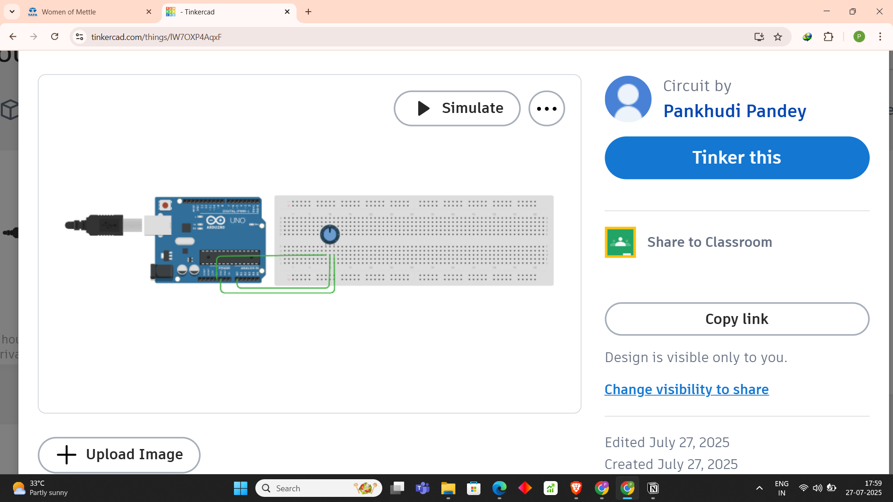

# Smart Energy Monitoring System (Simulation)

🔗 [View Live Simulation in Tinkercad]
(https://www.tinkercad.com/things/lW7OXP4AqxF-smartenergymonitor?sharecode=Ssx3UqqRct7p2G1BsERIYMMlYBxGnN2txptxVwKSjJg)

This project simulates a basic energy monitoring system using Arduino and a potentiometer to mimic the behavior of an ACS712 current sensor.

---

## 🔌 Components Used
- Arduino Uno
- Potentiometer (10kΩ)
- Breadboard
- Jumper Wires
- Simulated using Autodesk Tinkercad

---

## 📊 Functionality
- Reads analog voltage from a potentiometer to simulate ACS712 current sensor output
- Calculates current based on voltage variation
- Calculates power assuming a constant 230V AC supply
- Displays real-time current and power values on the Serial Monitor

---
> ⚡ **Note:**  
> In place of actual current or voltage sensors, a potentiometer is used to simulate varying analog signals.  
> This makes the project ideal for learning and testing logic without needing high-voltage components or specialized sensors.

---
## How to run

1. Open `energy_monitor.ino` in the Arduino IDE.
2. Connect components as shown in Tinkercad.
3. Upload the code to Arduino.
4. Open the Serial Monitor to view readings.


## 📷 Simulation Screenshot


---

## 💡 Arduino Code
```cpp
const int sensorPin = A0;
float sensitivity = 0.185; // Sensitivity of ACS712 (185 mV/A for 5A module)

void setup() {
  Serial.begin(9600);
}

void loop() {
  int adcValue = analogRead(sensorPin);
  float voltage = (adcValue * 5.0) / 1023.0;
  float current = (voltage - 2.5) / sensitivity;
  float power = 230.0 * current; // Assuming constant voltage supply

  Serial.print("Current: ");
  Serial.print(current, 3);
  Serial.print(" A, Power: ");
  Serial.print(power, 2);
  Serial.println(" W");

  delay(1000);
}
